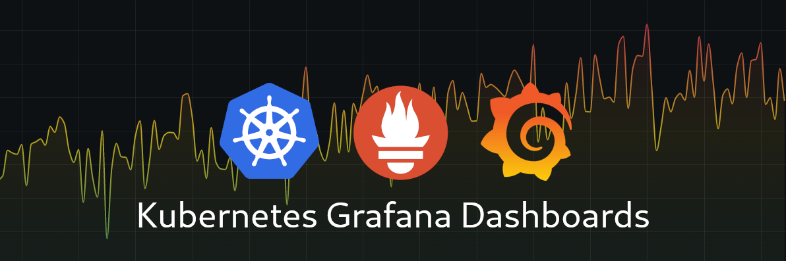
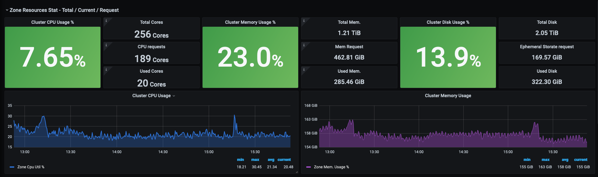

# Grafana dashboard for analysing Kubernetes resource wastage

## Table of contents

- [Description](#description)
- [Prerequisites](#prerequisites)
- [Usage](#usage)
- [Note](#note)
- [Contributing](#contributing)

## Description
Everyone care about the cost that we pay to the Cloud / Hosting provider for the compute resources. In case of Kubernetes, if we are not configuring the application resources properly, it can shoot the cost extensively. Especially during the testing or beta phase, if we are not checking the compute resource usage in our Kubernetes cluster, of course it can cause money leak.

I was spending considerable amount of time on Cost optimisation and did a lot of things to optimise the cost. In that, this is one of the important area. Understand the resources allocated to the Kubernetes cluster, and its actual usage. 

I am sharing/adding few dashboards in this repo, which will be helpful to understand whether the Kubernetes cluster is over provisioned or now. Based on the analysis, you will get a better start to think about the optimisation of your application resources requests and eventually scale down the Kubernetes cluster and optimise the cost

In the above image (from the L1 dashboard) it is clear that the k8s cluster is over provisioned. The k8s cluster is provisioned based on the requests, however, the actual usage is very less. We need to tweak the resources requests accordingly to scale down the node, which reduce the overall cost.

## Prerequisites 
This dashboard is using some [recording rules](https://prometheus.io/docs/prometheus/latest/configuration/recording_rules/) as few panel queries. Basically, those rules are there by default if the Prometheus is setup though the community helm chart. 

So these are the prerequisites:

- [Prometheus](https://www.crybit.com/category/devops/prom/) should install through operator. Otherwise, you need to create those recoding rules. 
- One of the drilldown dashboard links to one dashboard comes via Mixin dashboard. That also come through the community chart.

## Usage
The dashboards are adding inside the folder dashboards. You can copy the JSON content and add into your Grafana (by using Import option).

Once imported all panels, you can start analysis from the L1 -> L2 -> L3

L1 gives you an overview of your Kubernetes cluster resource allocation. If you notice any high requests configured on the name spaces, click on the namespace name and go to the L2 and analyze further. Further drill down can be done from the container level by using L3 dashboard.

## Note
The links in L2 dashboard might break because of the ID change of the mixin (L3). You can edit and update the link after setting up the L2 dashboard. If you do not have the Mixins dashboard you can import the L3 dashboard as well. No issues in that case.

## Contributing
Feel free to contribute to this project:

- Give a GitHub ⭐ if you like it
- Create an [Issue](https://github.com/ashokarun/grafana-dashboards-kubernetes-resource/issues) to make a feature request, report a bug or share an idea.
- Create a [Pull Request](https://github.com/ashokarun/grafana-dashboards-kubernetes-resource/pulls) if you want to share code or anything useful to this project.